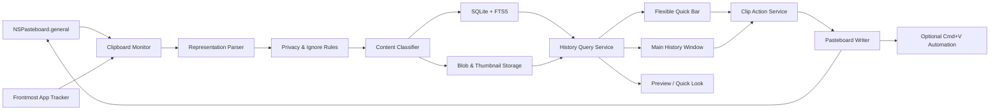

# PyPaste — Master Product & Engineering Plan

> This document is **source of truth** for the entire PyPaste development process.
> Any changes to scope, architecture, or deployment order must be recorded
> `Decision Log` and `Change Log` at the end of the document before execution.

## 0. Document status

|Property|Value|
|---|---|
|Product| PyPaste |
|The first platform| macOS |
|Status| Implementation — M2 Accessibility/TCC review |
|Document version| 1.16.7 |
|Update date| 2026-08-15 |
|Current Milestone| M2 — Clipboard Core Vertical Slice |
|Next task|PYP-219 — IN REVIEW; then PYP-001|
|Track progress| [progress/README.md](./progress/README.md) |

### Status convention

- `[ ]`: not started yet.
- `[x]`: completed and reached Definition of Done.
- The blocked task must be marked with the `Blocked by:` line immediately below the task.
- Do not mark completed when the new code can only run on the development machine.
- Do not start the next milestone when the phase gate of the current milestone has not been reached.

### How to use this document

1. Always read `Current Milestone` and `Next Task` before working.
2. Execute the task according to the ID and dependency order in the `Execution Backlog` section.
3. When completing the task, update the checkbox and write test evidence if necessary.
4. Only expand the scope after recording the decision in `Decision Log`.
5. Do not include P1/P2 features in MVP if you have not completed all P0.
6. At the end of each milestone, run the checklist phase gate before moving on to the milestone.
7. After each plan update, increase the document version and write `Change Log`.
8. Update the relevant file in `progress/` at the beginning and end of each work session.
9. `PLAN.md` decides **what to do**; `progress/` records **how far the work has progressed**.

---

## 1. Product Vision

PyPaste is a native clipboard manager for macOS, helping users save, search,
Preview, arrange and paste clipboard content quickly without interfering
The part of the application that is being used.

### Core value

1. **Quick:** The history appears almost immediately after copying.
2. **Native:** behavior and interface suitable for macOS.
3. **Local-first:** data on the user's device; network is only used for the feature
Clearly requested by users, such as a rich preview of a valid URL.
4. **Privacy-first:** do not save sensitive data at will.
5. **Keyboard-first:** all common operations can be performed by keyboard.
6. **Predictable:** does not automatically paste, sync, or send data when not enabled.

### User outcomes

Users must be able to:

- Automatically save copied content.
- Open clipboard history with system-wide shortcut.
- Find and paste content without leaving the working app.
- Filter history by content type, source application and collection.
- Preview text, rich text, photos, GIFs, PDF and files.
- Drag content or files from PyPaste to another application.
- Control which apps, content types, and folders are allowed to be saved.
- Pause clipboard observation and delete history.
- Use all core functions when there is no network connection.

### Non-goals for MVP

- Do not make iPhone/iPad apps.
- Do not do iCloud Sync.
- Do not share Peer.
- Do not create a user account or backend.
- Do not do OCR, AI classification or semantic search.
- Do not persist metadata/URL photos remotely to clipboard history or database.
- No promise to detect accurately every time paste in other applications.
- Do not clone entire large files into container app.

---

## 2. Reference Scope and legal limits

Product reference source:

- PastePal repository: <https://github.com/IndieGoodies/PastePal>
- PastePal website: <https://indiegoodies.com/pastepal>
- Seven UI images referenced provided by users on 2026-08-09 and 2026-08-10.

Repository PastePal is mainly displaying README, images and issues, not source
Full code of the application. PyPaste only references product flow and function list
Ability; no copying of icons, screenshots, brand assets, marketing slogans or source
PastePal's code.

### References

- Flexible Bar can be placed on the four edges of the screen.
- Main History has sidebar, adaptive grid, filter and search.
- Smart content types.
- Context menu and Quick Look preview.
- Quick Mode.
- Paste Stack.
- Privacy, allow list and ignore list.
- Peer Share in the internal network.

### Custom design requirements for PyPaste

- Create independent logo, icon and color system.
- Do not use exclusive feature names if there is a risk of confusing the brand.
- Wireframe must be rebuilt from user flow, not pixel-copy PastePal.
- Before public release, you must check the ability to register PyPaste name and bundle ID.

---

## 3. Release Scope and priority

### P0 — Mandatory MVP

- Clipboard observation.
- Basic text, rich text, URL, image and capture file.
- Source application tracking at the best effort level.
- Deduplication and loop feedback prevention.
- SQLite persistence and full-text search.
- Menu bar item.
- Main History Window.
- Flexible Quick Bar in the front bottom position.
- Custom Global shortcut.
- Copy, Paste and Paste as Plain Text.
- Basic favorites and collections.
- Basic context menu.
- Pause/resume observation.
- Ignore application and sensitive-content protection.
- History retention and clear history.
- Onboarding and permission handling.
- Signed/notarized beta build.

### P1 — PyPaste 1.0

- Quick Bar at the top, left and right.
- Pin/unpin and click-outside dismissal.
- Full PDF, GIF and multiple-file handling.
- Embedded preview and Quick Look panel.
- Drag-and-drop one or more items.
- Quick Mode based on key-down/key-up.
- Paste Stack.
- Advanced collection operations.
- Allow/ignore according to content type and folder.
- Import/export settings or appropriate history.

### P2 — PyPaste 1.1+

- Peer Share with Bonjour and Network framework.
- Pairing, TLS and device identity.
- iCloud Sync.
- iPhone/iPad app.
- Share extension and widget.
- Smart collections.
- Optional encrypted vault/lock mode.

---

## 4. Technical Baseline

### Platform

- Deployment target: macOS 14 or later.
- Language: Swift, Swift 6 language mode.
- UI: SwiftUI combines AppKit.
- Concurrency: Swift structured concurrency and actors.
- Beta release: Developer ID, notarized DMG.
- Mac App Store: review after technical spike about sandbox and auto-paste.

The name PyPaste does not mean using Python. Do not use Python or Electron
Run the runtime because AppKit provides the primitives needed for clipboard, menu
bar, floating panel, Quick Look and macOS window behavior.

### Main framework

- `AppKit`: NSPasteboard, NSPanel, NSStatusItem, NSWorkspace.
- `SwiftUI`: Main History, Settings, reusable card UI.
- `UniformTypeIdentifiers`: classify representation.
- `QuickLookUI`: preview panel.
- `QuickLookThumbnailing`: thumbnail file/PDF.
- `ServiceManagement`: Launch at Login.
- `ApplicationServices`: check Accessibility permission.
- `CoreGraphics`: optional keyboard event injection for auto-paste.
- `CryptoKit` and `Security`: Peer Share identity/key material later.
- `Network`: Peer Share via Bonjour later.

### Dependency strategy

- Persistence foundation uses `SQLite3` of the system, isolated after protocol
`DatabaseMigrating` and actor `SQLiteDatabaseMigrator`. Only consider GRDB when M3
certification requires more complex observation query or FTS abstraction.
- Only add KeyboardShortcuts at PYP-504 when starting global shortcut recorder;
No additional dependencies have been used in the foundation.

All new dependencies must be entered in `Decision Log`, accompanied by the reason, license and method
Substitute judgment before adding to the project.

### Overall architecture



### Module boundaries

```text
PyPaste/
├── App/
│   ├── PyPasteApp
│   ├── AppDelegate
│   ├── AppCoordinator
│   └── DependencyContainer
├── Core/
│   ├── Clipboard
│   ├── ContentDetection
│   ├── Privacy
│   ├── Search
│   ├── Preview
│   ├── Shortcuts
│   └── PeerShare
├── Domain/
│   ├── Models
│   ├── Services
│   └── Protocols
├── Data/
│   ├── Database
│   ├── Repositories
│   ├── BlobStore
│   └── Migrations
├── Features/
│   ├── MenuBar
│   ├── QuickBar
│   ├── History
│   ├── Collections
│   ├── PasteStack
│   ├── Settings
│   └── Onboarding
├── SharedUI/
├── Resources/
└── Tests/
    ├── UnitTests
    ├── IntegrationTests
    └── UITests
```

### Dependency rules

- `Domain` does not import SwiftUI, AppKit or specific persistence framework.
- `Core` depends on the protocol in `Domain`, does not access the direct view.
- `Data` implement repository protocol of `Domain`.
- `Features` uses service/repository through dependency injection.
- Do not access the database directly from the SwiftUI view.
- Do not read clipboard directly from view/controller.
- Clipboard parsing and blob generation do not run on the main thread.

---

## 5. Data Model

### `clips`

| Field |Purpose|
|---|---|
| `id: UUID` |Stable identity and prepare for sync|
| `createdAt` |The first capture time|
| `updatedAt` |The record time changes|
| `lastUsedAt` |Last copy/paste time|
| `sourceBundleID` |Bundle ID of the source application|
| `sourceApplicationName` |The display name of the source application|
| `contentKind` | text, URL, image, PDF, file... |
| `displayTitle` |Short title used in cards|
| `searchableText` |Content included in FTS|
| `characterCount` |Number of characters if available|
| `lineCount` |The number of lines if available|
| `contentHash` |Dedup and feedback-loop detection|
| `isFavorite` |Favorite status|
| `isSensitive` |Sensitive data is marked|
| `isDeleted` | Soft delete |
| `deletedAt` |Trash dumping time|
| `copyCount` |The number of clips that appear/reused|
| `primaryBlobPath` |Main Blob if available|
| `metadataJSON` |Metadata has version|

### `clip_representations`

A clipboard item can simultaneously contain plain text, HTML, RTF, and other UTTypes.
You must keep the original representation so that copying it does not lose format.

| Field |Purpose|
|---|---|
| `id` | Representation identity |
| `clipID` |Foreign key to the clip|
| `uti` | Uniform Type Identifier |
| `storageType` |inline, blob or file-reference|
| `inlineData` |Small payload|
| `blobPath` |Large payload in Application Support|
| `byteCount` |Quota and cleanup|
| `checksum` | Integrity verification |

### Support tables

- `collections`
- `clip_collections`
- `queue_entries`
- `ignored_applications`
- `content_rules`
- `folder_rules`
- `schema_migrations`

### Storage rules

- Metadata and small text are located in SQLite.
- Photos, GIFs, PDFs and large blobs are located in the Blob Store.
- Thumbnail separated from original blob.
- Default URL file is saved as a reference; do not copy large files by yourself.
- Blob does not have a database reference anymore and must be cleared by cleanup job.
- All schema changes must have forward migration and migration test.

---

## 6. Functional Specifications

### 6.1 Clipboard Observation

#### Behavior

- Poll `NSPasteboard.general.changeCount` according to the appropriate interval.
- Initial interval: 300–500 ms when active.
- Reduce activity when session lock, sleep or observation is paused.
- When changing count, change the snapshot clipboard and parse outside the main thread.
- Track the frontmost app continuously with `NSWorkspace` instead of only querying after changing.
- Source application is just the best effort.

#### Deduplication

- Create canonical content hash by SHA-256.
- Default duplicate policy: update `lastUsedAt`, increase `copyCount`, put the clip at the beginning.
- Allows the setting to create a new record for duplicate in the future.
- The write pasteboard created by PyPaste must attach internal marker or track own-write state.
- Own-write cannot be captured as a new clip.

#### Edge cases

- Empty Clipboard.
- Many pasteboard items.
- Lazy data provider.
- File was deleted during capture.
- Payload is too large.
- Universal Clipboard arrives late.
- The exit source app immediately after copying.

### 6.2 Smart Content Detection

Precedence order:

1. Multiple files.
2. Single file.
3. PDF.
4. GIF.
5. Image.
6. Rich text/HTML/RTF.
7. URL.
8. Hex/RGB color.
9. Emoji-only.
10. Plain text.
11. Unknown/raw data.

#### Rules

- Always keep the original representation before creating normalized representation.
- Text normalization only serves search and display.
- Valid HTTP(S) URL can download metadata with LinkPresentation when the card appears;
All errors/timeouts must fallback to offline host/path.
- HTML preview must disable scripts and external resources by default.
- Image/PDF thumbnail is created asynchronously.
- Payload exceeding the size limit cannot cause UI suspension.
- Unknown type can be saved if it falls within the size limit and privacy policy allows.

### 6.3 Main History Window

#### Sidebar

- All.
- Favorites.
- Trash.
- Collections.
- Applications.
- Content Types.
- Settings entry or private Settings scene.

#### Content area

- Default Adaptive grid.
- Optional list mode.
- Lazy rendering.
- Thumbnail caching.
- Infinite scroll/keyset pagination.
- Multi-selection.
- Empty, loading and error states.

#### Search and filter

- FTS search by text, title, URL and app source.
- Filter by app, type, collection and date.
- Sort by created, last used or app.
- Short debounce search; does not block the main actor.
- Query must support cancellation when the user continues typing.

### 6.4 Context Menu

- Copy.
- Paste.
- Paste as Plain Text.
- Preview.
- Favorite/unfavorite.
- Add/remove Collection.
- Add to Paste Stack.
- Share/export.
- Reveal original file if still exists.
- Delete.
- Restore from Trash.
- Delete Permanently with confirmation.

### 6.5 Flexible Quick Bar

#### Position

- MVP: bottom.
- PyPaste 1.0: top, left, right.
- Choose the screen that contains the mouse pointer by default.
- Calculate the frame from `NSScreen.visibleFrame`.
- Respect Dock, menu bar, notch, Spaces and full-screen app.

#### Window behavior

- Use custom `NSPanel`.
- Remember to activate the app before opening.
- Esc closes the panel.
- Arrow keys change selection.
- Enter to perform the default action.
- Type the character to switch to search mode.
- Battery keeps the display panel.
- Unpin allows clicking outside to close.
- Do not activate the app if it is only in glance/navigation mode when possible.

#### Card content

- Source app icon.
- Content preview.
- Content type.
- Collection/favorite indicator.
- Character/file count.
- Relative timestamp.
- Clear selection state for keyboard navigation.

### 6.6 Copy and Paste Workflow

#### Copy

1. Load all clip representations.
2. Clear pasteboard.
3. Record compatible representations.
4. Mark the own-write state.
5. Update `lastUsedAt` and `copyCount`.

#### Paste

1. Record the target application before PyPaste receives focus.
2. Implement Copy workflow.
3. Close or hide the Quick Bar.
4. Return focus to the target application.
5. If Accessibility has been granted, send Cmd+V.
6. If not granted, just copy and display feedback that does not interfere.

#### Paste as Plain Text

- Only write UTF-8 plain text representation.
- Original record not corrected.
- Do not keep HTML/RTF in the new pasteboard.

### 6.7 Global Shortcuts

- Toggle Quick Bar.
- Open Main Window.
- Copy selected.
- Paste selected.
- Paste as Plain Text.
- Next/previous clip.
- Toggle Quick Bar position.
- Pause/resume observation.

Users choose shortcuts in onboarding or settings. Do not occupy a global
Fixed shortcut when public release. In development build, `⌘⇧V` is shortcut
default to toggle Bottom Quick Bar according to user requests; recorder/customization
still in PYP-504/PYP-610 before public release.

### 6.8 Preview

- Raw text preview.
- Rich text preview.
- Sanitized HTML preview.
- Image and animated GIF preview.
- PDF/file preview through Quick Look.
- Spacebar opens or closes preview.
- Preview only loads original blob when needed.
- The reference file that does not exist must clearly have an unavailable state.

### 6.9 Drag and Drop

- Drag text in plain text and rich representation format appropriately.
- Drag image/PDF blob with temporary file when needed.
- Drag one or more URL files.
Drag the clip to the collection.
Drag the clip into Paste Stack.
- Temporary export files must be safely cleaned.

### 6.10 Collections and Favorites

- Create, rename, change colors/icons, arrange and delete collections.
- One clip can belong to many collections.
- Delete collection does not delete clip.
- Favorite is an independent attribute.
- Support drag-and-drop into collection.
- Smart collection for P2.

### 6.11 Paste Stack

- Queue temporarily includes many clips.
- Add/remove/reorder.
- Paste each item.
- Paste all in order.
- Separator settings for text.
- Clear stack.
- Remove-after-paste option.
- Stack by default does not sync.

### 6.12 Privacy Rule Engine

Pipeline must run before persistence:

1. Snapshot source application.
2. Check the application allow/ignore list.
3. Check clipboard-provided sensitive/transient hints.
4. Check the content type and folder rules.
5. Run heuristic if the user turns on.
6. Decision `allow`, `redact` or `skip`.
7. Only then write database/blob.

#### Principle

- No log clipboard payload.
- Do not send analytics by default.
- Do not call the network for the default clipboard payload; rich preview is only allowed
send the HTTP(S) URL that has been classified according to ADR-017.
- Password manager and sensitive source must have ignore protection.
- Heuristic does not silently delete data if the user has not selected the policy.
- There is an easy-to-access Pause Observation button.
- Clear History and Clear All Data are available.

### 6.13 Settings

#### General

- Launch at Login.
- Show in menu bar.
- Copying sound.
- Animation.
- Default action: copy or paste.

#### History

- Retention by date.
- Maximum item count.
- Maximum storage size.
- Duplicate policy.
- Trash retention.

#### Privacy

- Save/ignore sensitive content.
- Application allow/ignore list.
- Content-type rules.
- Folder rules.
- URL metadata fetching.

#### Shortcuts

- Recorder for each action.
- Detect conflict.
- Reset shortcut.

#### Appearance

- System/light/dark.
- Grid/list.
- Quick Bar position and size.
- Card density.

#### Data

- Suitable export.
- Clear history.
- Clear all data.
- Show storage usage.

### 6.14 Quick Mode

1. Key-down opens Quick Bar.
2. Repeated key-down moves selection.
3. Key-up copy or paste according to the setting.
4. Esc cancels and does not change the clipboard.
5. If there is a focus/permission error, fallback to copy-only.

Quick Mode only starts after shortcuts, Quick Bar and PasteCoordinator are stable.

### 6.15 Peer Share

- Use `NWListener` to promote Bonjour service.
- Use `NWBrowser` to find peer.
- Use `NWConnection` to transmit framed messages/resources.
- Pair for the first time with the confirmation code displayed on both devices.
- Device identity saved in Keychain.
- TLS is mandatory.
- The recipient must accept or trust the device.
- Network is off by default.
- There is an equipment allow list.
- Validate content type, size and checksum before saving.
- Do not use Multipeer Connectivity as a new baseline.

---

## 7. UX Flows are mandatory

### Flow A — First Launch

1. Introduce local-first/privacy.
2. Choose global shortcut.
3. Explain Accessibility only needs auto-paste.
4. Allow copy-only use without granting permission.
5. Choose Launch at Login.
6. Open the Quick Bar demo.

### Flow B — Capture and reuse

1. Users copy in application A.
2. PyPaste capture and classify.
3. The clip appears in history.
4. Users switch to application B.
5. Open Quick Bar.
6. Choose the clip.
7. Paste or copy-only depending on permission.

### Flow C — Search history

1. Open Quick Bar or Main Window.
2. Type query.
3. Update results have debounce.
4. Use arrow key to select.
5. Space preview or Enter to perform the action.

### Flow D — Sensitive content

1. Clipboard changes from apps that are ignored or have sensitive hints.
2. Rule engine runs before persistence.
3. The clip is skipped/redacted according to the policy.
4. There is no payload in the database, blob or log.

### Flow E — Permission denied

1. Users choose Paste.
2. PyPaste detects that there is no Accessibility.
3. The clip is still copied to the clipboard.
4. The UI briefly says that you need to press Cmd+V manually.
5. Settings provides a button to open the section of permissions when the user wants to turn on auto-paste.

---

## 8. Execution Backlog

### M0 — Product Definition and UX

- [ ] **PYP-001:** Lock in deployment target, distribution channel and temporary bundle ID.
- [ ] **PYP-002:** Write a one-page PRD for MVP based on items 1–3.
- [ ] **PYP-003:** Create wireframe Main History Window.
- [ ] **PYP-004:** Create wireframe Quick Bar bottom.
- [ ] **PYP-005:** Create wireframe Settings and Onboarding.
- [ ] **PYP-006:** Lock keyboard navigation map.
- [ ] **PYP-007:** Lock the size limit for inline data, blob and reference files.
- [ ] **PYP-008:** Lock retention default and duplicate policy.
- [ ] **PYP-009:** Create a basic privacy threat model.
- [ ] **PYP-010:** Record ADR for SQLite/GRDB and KeyboardShortcuts.

#### M0 Phase Gate

- [ ] MVP screen flows have been approved.
- [ ] Any decision that affects data has ADR.
- [ ] Non-goals have been confirmed.
- [ ] There is no blocking question for the first vertical slice.

### M1 — Project Foundation

- [x] **PYP-101:** Create Xcode workspace, app, unit test and UI test targets.
- [x] **PYP-102:** Create Core, Data, Domain, Features and SharedUI structure modules.
- [x] **PYP-103:** Set up AppCoordinator and dependency container.
- [x] **PYP-104:** Set unified logging with OSLog, no payload recording.
- [x] **PYP-105:** Set up persistence layer using native SQLite3 after protocol.
- [x] **PYP-106:** Set up SwiftLint and swift-format quality gate; postpone
KeyboardShortcuts to PYP-504 according to ADR-005.
- [x] **PYP-107:** Create migration runner with multiple versions and database smoke test.
- [x] **PYP-108:** Create a skeleton NSStatusItem/menu bar. The menu opens with action
of `NSStatusBarButton` itself; button bounds are changed through window to absolute
Screen frame before anchoring popup at bottom-leading. Implicit is not used
`statusItem.menu` anchor or flipped view coordinates can make popup offset or
Cut out the front row. Reentrancy guard ensures that a click only presents a menu.
- [x] **PYP-109:** Create Main Window and Settings skeleton scene.
- [x] **PYP-110:** CI build, lint, package test and app unit test settings.
- [x] **PYP-111:** Use the monogram `Py` selected by the user as the AppIcon; create enough
macOS asset slots 16–1024 px and connect `AppIcon` to Debug/Release target.
- [x] **PYP-112:** Replace the SF Symbol of `NSStatusItem` with the monogram `Py` format
18 pt template, with 1x/2x asset and Light/Dark Mode self-adaptation. Menu bar used
The letter `py` is written in SF Rounded Bold 12 pt, centered with a balanced breathing space
by neighboring apps; AppIcon and logo elsewhere remain unchanged. Vector generator
create asset deterministically.

#### M1 Phase Gate

- [x] Clean build with new DerivedData successful in Debug and Release.
- [x] Unit test, package test and UI smoke test run successfully.
- [x] Open the app from the menu bar and open the Main Window.
- [x] Database create/migrate idempotent through version 1 and 2 on temporary folder.
- [x] Asset catalog compile `AppIcon.icns` and bundle declare `CFBundleIconName`.
- [x] Asset catalog containing `MenuBarIcon` non-opaque at 1x/2x with template mode.

### M2 — Clipboard Core Vertical Slice

- [x] **PYP-201:** Create `PasteboardProviding` protocol and system adapter.
- [x] **PYP-202:** Poll `changeCount` every 350 ms; stop when sleep/session inactive.
- [x] **PYP-203:** Implement pause/resume with fresh baseline when continuing.
- [x] **PYP-204:** Track the frontmost application on a best-effort basis through `NSWorkspace`.
- [x] **PYP-205:** Snapshot all pasteboard items and UTTypes, then move heavy processing
  to a background actor.
- [x] **PYP-206:** Categorize and save minimal metadata for text, rich text, URL,
image/GIF, PDF, file and multiple files; full parser/thumbnail are still in M3.
- [x] **PYP-207:** Create canonical SHA-256 hash, normalize text/file URL and keep
Item itself.
- [x] **PYP-208:** Implement own-write suppression by change count + marker and
Block race when clipboard changes during capture.
- [x] **PYP-209:** Persist clip with ordered representations into SQLite migration v3.
- [x] **PYP-210:** Display live clip in Main Window and expose pause/resume.
- [x] **PYP-211:** Copy all pasteboard items/representations in the correct order.
- [x] **PYP-212:** Implement two duplicate policies and integration/performance tests.
- [x] **PYP-213:** Register global shortcut by default `⌘⇧V` to open Main Window;
Create an API system after protocol and safely unregister when the app stops.
- [x] **PYP-214:** Replace shortcut with `⌃⇧V`, create Bottom Quick Bar as a horizontal card;
Click the card, copy, focus on the app first, send `⌘V`, and close the panel when pasting
Successful. If
Accessibility has not been granted yet, explicit permission and fallback copy-only requirements are necessary.
- [x] **PYP-215:** According to the user's correction, replace the Quick Bar shortcut with
`⌘⇧V`; refine the bottom panel according to the new reference photo with system material,
Clipboard History bar and card with color header/neutral content. Only show
collection/template when there is real data; keep click-to-paste and permission fallback unchanged.
- [x] **PYP-216:** Transfer Quick Bar to liquid glass black-and-white language; only
The HEX code clip color is used in real color. Always display the app source; valid URL displayed
rich preview includes avatar, title and domain, offline fallback available; support
`←`/`→` select the card, `Return` paste and `Esc` close the panel.
Quick Bar is activating/key panel when appearing and dismiss automatically when PyPaste
Lost application focus. While the popup is still focused, PyPaste posts
Temporarily sign four global hotkeys without modifier for `←`, `→`, `Return`, `Esc` always
Quick Bar control; hotkey is removed immediately when closed or deactivated. Popup closed
by pressing the `×`, `Esc` buttons, lose focus, paste to the destination app or when the app terminates.
Panel width is 80% of the visible frame and screen center.
- [x] **PYP-217:** Track the purpose of the macOS Screenshot folder; when taking a new photo
Saved as a file, identified by metadata screen-capture with fallback filename,
After the file is completed, write the original photo data to the clipboard for the capture engine to save
Enter history. Do not import old/ordinary photos; pause with pause/app lifecycle.
- [x] **PYP-218:** Fix Quick Bar to maximize six cards lying in the viewport with inset
two edges; delete selected scale to create clip, use inner border and ensure each time
Press left/right to move an item even if macOS plays key repeat.
- [ ] **PYP-219:** Developer Accessibility/TCC verification stable: hosted unit
test cannot start production coordinator/global shortcut; Debug app
Apple Development identity must be stable and real-device test must be used to confirm grant
Valid after rebuild, click/Return paste to the correct target application. When not trusted,
system permission prompt is only requested once in each app session.
**State:** IN REVIEW — stable Apple Development signing has passed; waiting for reset/
regrant and real paste verification.
- [x] **PYP-220:** Complete screenshot/image thumbnail preview; add explicit
persistent display order to drag-and-drop card; paste/copy metadata update is not
You can change the position by yourself; `×` button in the left corner soft-delete the correct clip. Keep absolutely unchanged
item/representation order when reconstruct pasteboard and decode thumbnail off-main.
**State:** DONE — migration v4, thumbnail off-main, persistent order, paste hold
The position and soft-delete have passed regression/runtime smoke test. Image preview is
Limited to content slot 99 pt, cannot overflow the header/footer of the card.
Header uses the local accent of the source app, selects the contrasting foreground and does not
to PyPaste activation saves the latest external app source. When dragging the card, the location
preview before/after inserted with glowing rail and highlight target card; hover
Do not change the order, commit only once when the user releases the mouse.
- [x] **PYP-221:** Add fuzzy search for Quick Bar and Main History on the episode
history is loading (maximum 200 clips). Search simultaneously title, searchable content,
source app name/bundle ID and content-type aliases; omit flowers/regular, width and
Vietnamese punctuation, prefix/substring support and small typos. The result is relevance-ranked
but keep canonical order at the same point; debounce input 120 ms, empty state/count
Clearly and keyboard selection/paste/delete is still correct. Drag reorder is locked when
search active so as not to mix relevance order with persistent `sort_rank`.
  **State:** DONE — fuzzy matcher 4/4, model integration 2/2, full package 88/88,
signed build and 75-file lint pass. FTS5/cancellable database search for 100,000
clip still belongs to PYP-311/PYP-312 in M3.
- [x] **PYP-222:** Add Quick Bar collection vertical slice: search correctly
Panel center; `Clipboard` is always the default tab each time opened; seed `Useful Links`,
`Important Notes`, `Email Templates`, `Code Snippets`; `+` button creates collection
Customize and `+` menu on each card to add clips to one or more collections.
Membership, custom collection and retention protection flag must persist in
SQLite migration v5 through restart/reboot app; clip entered the collection just disappeared
after active deletion operation. Rename/recolor/reorder collection still belongs to PYP-410.
**State:** DONE — migration/repository/model 25/25 pass; full app and all tests
target compile; 82-clean SwiftLint file. Targeted XCUI build/sign pass but app
launch was blocked by an old PyPaste version running, so manual visual smoke was left.
- [x] **PYP-223:** When hovering a real collection, `×`; `Clipboard` is not displayed
Can delete. Click `×` must open confirmation alert with destructive action and explanation
The clip is still in the Clipboard. Confirm deleting collection/membership with SQLite
foreign-key cascade but does not delete clips or lower retention protection; if
If you see the collection is deleted, safely transfer it to Clipboard. Cancel without changing the data.
  **State:** DONE — model/repository regression 13/13, app + UI test target build
and 83-file lint pass; targeted hover/confirm/delete XCUI is recorded in tracker.
- [x] **PYP-224:** `Esc` must close the top collection dialog before Quick Bar.
Create and Delete dialog uses a mutually exclusive modal state in the model;
local AppKit event and global Carbon command follow this priority. When dialog
Open, Return/arrow from global router cannot paste/change card; local non-Esc event
Returned SwiftUI for text field/alert processing. The next `Esc` time will dismiss
Quick Bar. The new Presentation always resets the old modal state.
  **State:** DONE — collection-dialog model 5/5, app keyboard router 2/2, full
app/UI-test target build and 83-file lint pass; targeted XCUI recorded in tracker.
- [x] **PYP-225:** Eliminate the delay perceived when `Esc` closes Create/Delete collection
dialogue. Do not use the system `.alert` with dismissal animation that cannot be controlled;
Instead of the modal overlay located in the Quick Bar, removed from the hierarchy view immediately
modal state clear. Overlay still blocks the interaction of the card behind, autofocus the name box,
keep Cancel/default/destructive actions, accessibility identifiers and rules
`Esc` two floors of PYP-224. No transition or exit animation added.
  **State:** DONE — collection model 5/5, local/global keyboard router 2/2,
full app/unit/UI-test target build and 84-file lint pass.
- [x] **PYP-226:** Increase visual separation for shared search fields in Quick Bar
and Main History. No border used; the state usually has adaptive Light/Dark
background and shadow spread wide. Focus status slightly increases background brightness, accent icon
and shadow depth by animation `easeInOut` 180 ms. Keep width, search
debounce, clear action, accessibility identifier and search behavior.
**State:** DONE — signed macOS app build and 84-file format/lint pass.
- [x] **PYP-227:** Allows dragging cards from Quick Bar to another macOS app. Each
drag provider must export original representations of the clip according to clipboard order
(text/rich text/URL/image/PDF/file and compatible type), and also bring custom
marker clip-ID with visibility `ownProcess` is only for reordering in PyPaste. Drop
The internal accepts only private markers, does not consider plain text outside as reorder.
If the same UTType appears in multiple clipboard items in a card, provider
The priority order of representation of the first item; the full multi-provider drag still belongs
PYP-808. Text-like clip lacks payload with UTF-8 fallback; image/file is not
replace it with display title.
  **State:** DONE — payload tests 4/4, drag/reorder regression 23/23, signed app
build and 85-file lint pass. Full package 97/101 pass; four test system-resource
The old one has a hotkey/named-pasteboard conflict, unrelated to external drag.
- [x] **PYP-228:** Support English and Vietnamese with shared observable
localization service. The status menu has a `Language` submenu directly below
monitoring with two options, checkmark for the current language and save UserDefaults
go to restart app. Changes apply immediately without relaunching for status menu,
  Quick Bar, Main History, Settings, collection dialogs, feedback, search,
content-type labels and accessibility text. English is the default when not selected.
  **State:** DONE — localization 4/4, Features regression 46/46, status-selector
integration 1/1, signed app build and 89-file lint pass. Full package 101/105;
Four errors of old system resources due to hotkey/named pasteboard being occupied.
- [x] **PYP-229:** Standardize the repository authoring language. Swift identifiers,
  comments, diagnostics, test descriptions, scripts, and all Markdown documentation
  use English. Vietnamese remains only where required as localization data or as a
  test fixture that verifies Vietnamese UI, search normalization, or localized macOS
  screenshot names. Preserve all task IDs, checkboxes, links, code fences, tables, and
  historical records during conversion.
  **State:** DONE — Markdown/source language audits and structural comparison pass;
  format/lint and signed app build pass. Package regression is 101/105, with four
  known system-resource conflicts (Carbon hotkeys and named pasteboard) unrelated
  to documentation or source authoring.
- [x] **PYP-230:** Prepare the repository for public development and the first preview
  release. Split the operational tracker into focused files under `progress/`; add a
  Vietnamese-first, English-second installation and feature guide; remove personal
  signing identifiers and ignore credentials, local settings, build caches, and generated
  artifacts; initialize Git, publish `main`, create a verified universal macOS archive,
  and upload version 0.1.0 to GitHub Releases.
  **State:** DONE — secure staged-tree audit, universal signed archive, source publication,
  published GitHub Release, uploaded checksum verification, format/lint, and regression evidence pass.

#### M2 Phase Gate

- [x] Clip appears in UI callback below 750 ms p95 with polling production 350 ms.
- [x] Recopy from PyPaste does not create a feedback loop.
- [x] 32 MiB fake photo is hashed/persist that MainActor is still responsive.
- [x] Multiple clipboard items are persisted and reconstructed in the correct order.
- [x] Source application is saved best effort.
- [x] Clipboard payload does not appear in the log.
- [x] `⌘⇧V` development shortcut that was registered and opened Main Window before
replaced by PYP-214.
- [ ] `⌘⇧V` toggle panel at the bottom of the active screen; click/Return paste the correct target
from the Apple Development-signed app when Accessibility is granted, grant is valid
after rebuild and without losing data when rights are denied.
- [x] `⌘⇧V` is the only current shortcut; Quick Bar is new for build, unit/UI test
and clicking the card still rounds the clipboard, right?
- [x] Quick Bar claim key-window focus even when opened from the status menu; `→`, `Return`
and `Esc` pass end-to-end XCUI without having to click on the popup first.
- [x] HEX/URL detection, source app label/accent and keyboard selection pass tests;
rich URL preview downloads metadata asynchronously, with limited timeout/cache and retention
offline fallback; source-app accent still only reads local icon.
- [x] Screenshot/image showing real thumbnail; ImageIO decode/downsample does not
run on MainActor and do not change the original representations.
- [x] Drag order can be persisted with `sort_rank`; paste/copy only updates metadata
and without changing the display order.
- [x] Drag hover preview appears at the correct before/after edge, resists midpoint jitter, and does not
reflow card and only receive PyPaste internal payload; Reduce Motion is respected.
- [x] The `×` soft-delete button deletes the card correctly, does not paste/copy at the same time and does not change
  pasteboard `changeCount`.
- [x] Multi-item/multi-representation reconstruct UTI, data and original order correctly.
- [x] Screenshot saved as a file automatically enters the clipboard/history; screenshot recorded
Directly into the clipboard, it still uses the existing capture flow and does not create a feedback loop.
- [x] Quick Bar does not cut the front/back card and arrow navigation goes to the correct item.
- [x] Screenshot/image clip renders real thumbnail without decoding large images on MainActor.
- [x] Drag order persists after closing/reopening Quick Bar and relaunching; pasting an item does not
change the display order, while the new capture/duplicate policy still has clear semantics.
- [x] The `×` button deletes the card correctly, does not write/paste clipboard and soft-delete exists after reload.
- [x] Multi-item/multi-representation pasteboard is reconstructed correctly UTI/data/order.
- [x] Loaded-history fuzzy search finds title/app/content/type, regardless
normal flower/pattern; clear query restores canonical order and does not break keyboard paste.

### M3 — Persistence, Search and Content Types

- [ ] **PYP-301:** Complete the `clips` schema.
- [ ] **PYP-302:** Create `clip_representations` and Blob Store.
- [ ] **PYP-303:** Harden duplicate-policy transactions for Blob Store/FTS5;
Basic behavior has been introduced early in PYP-212.
- [ ] **PYP-304:** Implement rich text/HTML/RTF parser.
- [ ] **PYP-305:** Implement URL classifier.
- [ ] **PYP-306:** Implement color and emoji classifier.
- [ ] **PYP-307:** Implement image/GIF parser.
- [ ] **PYP-308:** Implement PDF parser.
- [ ] **PYP-309:** Implement single/multiple file parser.
- [ ] **PYP-310:** Implement thumbnail service.
- [ ] **PYP-311:** Create FTS5 index and migration.
- [ ] **PYP-312:** Implement cancellable search query.
- [ ] **PYP-313:** Implement keyset pagination.
- [ ] **PYP-314:** Implement blob quota and orphan cleanup.
- [ ] **PYP-315:** Round-trip tests for each content type.

#### M3 Phase Gate

- [ ] The content types P0 round-trip are correct.
- [ ] Search 100,000 text clips below 150 ms p95 on benchmark machines.
- [ ] Grid does not load original image/PDF when previewing.
- [ ] Blob orphan is safely cleaned.

### M4 — Main History and Organization

- [ ] **PYP-401:** Sidebar All/Favorites/Trash.
- [ ] **PYP-402:** Application filters.
- [ ] **PYP-403:** Content type filters.
- [ ] **PYP-404:** Adaptive lazy grid.
- [ ] **PYP-405:** Optional list mode.
- [ ] **PYP-406:** Search toolbar and combined filters.
- [ ] **PYP-407:** Multi-selection.
- [ ] **PYP-408:** Context menu P0 actions.
- [ ] **PYP-409:** Favorite/unfavorite.
- [ ] **PYP-410:** Collection CRUD.
- [ ] **PYP-411:** Soft delete, restore and permanent delete.
- [ ] **PYP-412:** Keyboard navigation and accessibility labels.

#### M4 Phase Gate

- [ ] You can manage 100,000 clips without freezing UI.
- [ ] Filter combines return results.
- [ ] Delete/restore does not lose the wrong blob target.
- [ ] Main flow can be used with basic keyboard and VoiceOver.

### M5 — Menu Bar, Quick Bar and Paste

- [ ] **PYP-501:** Menu bar menu and observation indicator.
- [ ] **PYP-502:** Custom bottom NSPanel.
- [ ] **PYP-503:** Quick Bar card layout.
- [ ] **PYP-504:** Global shortcut recorder.
- [ ] **PYP-505:** Toggle Quick Bar shortcut.
- [ ] **PYP-506:** Arrow navigation, Enter and Esc.
- [ ] **PYP-507:** Inline search mode.
- [ ] **PYP-508:** Preserve previous active application.
- [ ] **PYP-509:** PasteboardWriter for all P0 representations.
- [ ] **PYP-510:** Paste as Plain Text.
- [ ] **PYP-511:** Accessibility status service.
- [ ] **PYP-512:** Auto-paste with Cmd+V when allowed.
- [ ] **PYP-513:** Copy-only fallback.
- [ ] **PYP-514:** Multi-monitor and full-screen tests.
- [ ] **PYP-515:** Focus regression tests.

#### M5 Phase Gate

- [ ] Quick Bar opens/closes stably with shortcut.
- [ ] Do not paste it into the wrong app in the matrix test.
- [ ] Copy-only operation when Accessibility is denied.
- [ ] There is no error in the monitor or visible frame.

### M6 — Privacy, Settings and Lifecycle

- [ ] **PYP-601:** PrivacyRuleEngine protocol and decision model.
- [ ] **PYP-602:** Application ignore list.
- [ ] **PYP-603:** Sensitive/transient hint handling.
- [ ] **PYP-604:** Content-type rules.
- [ ] **PYP-605:** File-folder rules.
- [ ] **PYP-606:** Privacy tests run before persistence.
- [ ] **PYP-607:** General settings UI.
- [ ] **PYP-608:** History/retention settings UI.
- [ ] **PYP-609:** Privacy settings UI.
- [ ] **PYP-610:** Shortcut settings UI.
- [ ] **PYP-611:** Appearance settings UI.
- [ ] **PYP-612:** Retention cleanup scheduler.
- [ ] **PYP-613:** Clear History and Clear All Data.
- [ ] **PYP-614:** Launch at Login using SMAppService.
- [ ] **PYP-615:** First-launch onboarding.

#### M6 Phase Gate

- [ ] Ignored/sensitive payload does not exist in DB, blob or log.
- [ ] Cleanup respects favorites/collections according to the locked policy.
- [ ] Clear All Data has a test to confirm that there are no blobs left.
- [ ] The app works correctly when Launch at Login is rejected by the system.

### M7 — MVP Hardening and Beta Release

- [ ] **PYP-701:** Unit test coverage for parser/classifier/rules/dedup.
- [ ] **PYP-702:** Integration test full capture pipeline.
- [ ] **PYP-703:** UI smoke tests for onboarding/history/quick bar/settings.
- [ ] **PYP-704:** Performance benchmark 100.000 clips.
- [ ] **PYP-705:** Idle CPU and memory profiling.
- [ ] **PYP-706:** Large image/PDF/file stress tests.
- [ ] **PYP-707:** Database migration/recovery tests.
- [ ] **PYP-708:** Sleep/wake, lock/unlock and fast-user-switch tests.
- [ ] **PYP-709:** Multiple monitors, Spaces, Stage Manager and full-screen tests.
- [ ] **PYP-710:** Accessibility denied/granted/revoked tests.
- [ ] **PYP-711:** Security/privacy review.
- [ ] **PYP-712:** App icon and original brand assets.
- [ ] **PYP-713:** Archive, code sign and notarize.
- [ ] **PYP-714:** Install beta on a clean machine.
- [ ] **PYP-715:** Write release notes and known issues.

#### M7 Phase Gate — MVP Done

- [ ] All P0 acceptance criteria are met.
- [ ] There is no P0/P1 severity bug open.
- [ ] Signed/notarized build runs on clean machine.
- [ ] Privacy behavior has been verified.
- [ ] Known limitations are clearly stated.

### M8 — PyPaste 1.0 Advanced Features

- [ ] **PYP-801:** Quick Bar top position.
- [ ] **PYP-802:** Quick Bar left/right positions.
- [ ] **PYP-803:** Pin/unpin and click-outside dismissal.
- [ ] **PYP-804:** Embedded raw/rich/image preview.
- [ ] **PYP-805:** Quick Look PDF/file preview.
- [ ] **PYP-806:** Spacebar preview workflow.
- [ ] **PYP-807:** Drag text/image/file to another app.
- [ ] **PYP-808:** Multi-item drag.
- [ ] **PYP-809:** Paste Stack schema and UI.
- [ ] **PYP-810:** Stack reorder/paste-one/paste-all.
- [ ] **PYP-811:** Quick Mode key-down/repeat/key-up.
- [ ] **PYP-812:** Advanced collection drag-and-drop.
- [ ] **PYP-813:** P1 regression test suite.

### M9 — Peer Share

- [ ] **PYP-901:** Peer Share threat model and protocol specification.
- [ ] **PYP-902:** Bonjour advertisement using NWListener.
- [ ] **PYP-903:** Discovery with NWBrowser.
- [ ] **PYP-904:** Framed transport by NWConnection.
- [ ] **PYP-905:** Device identity and Keychain storage.
- [ ] **PYP-906:** Pairing confirmation UX.
- [ ] **PYP-907:** TLS and trust persistence.
- [ ] **PYP-908:** Transfer text metadata.
- [ ] **PYP-909:** Transfer blob/resource has progress.
- [ ] **PYP-910:** Validate type, size and checksum.
- [ ] **PYP-911:** Device allow/revoke UI.
- [ ] **PYP-912:** Network-off default and permission copy.
- [ ] **PYP-913:** Adversarial/security tests.

---

## 9. Quality Targets

### Performance

- Capture-to-visible latency: less than 750 ms p95.
- Search 100,000 text clips: less than 150 ms p95 on benchmark machines.
- CPU idle: below 1% on benchmark machines on average.
- Do not decode full-size image/PDF just to render grid card.
- App launch to the menu bar ready: goal under 2 seconds.
- All targets must clearly indicate the machine model and macOS version when measuring.

### Reliability

- No feedback loop.
- Database migration does not lose data.
- Blob write uses atomic replace when appropriate.
- Crash between database write and blob write with recovery path.
- Corrupt reference file does not crash UI.
- Permissions changed while the app is running are reflected in Settings.

### Privacy

- Network is only used for clear features: rich URL preview and Peer Share when
Can be deployed; other clipboard payloads are not sent out.
- Zero clipboard payload in log/crash breadcrumbs.
- Privacy rule runs before any persistent write.
- Clear All Data deletes database, blob, thumbnail and related cache.
- Export must be a clear action initiated by the user.

### Accessibility

- Keyboard navigation for Main Window and Quick Bar.
- VoiceOver label for card clip and main control.
- Do not only use colors to express state.
- Respect Reduce Motion and Increase Contrast when possible.

---

## 10. Test Matrix

### Content types

- Empty/plain text/multiline text.
- Unicode, Vietnamese, CJK, RTL and emoji.
- HTML + RTF + plain text with the same item.
- Valid/invalid URL.
- Hex color and text are similar in color but invalid.
- PNG, JPEG, TIFF, GIF.
- Small/large PDF.
- Single file, multiple files, missing file.
- Clipboard item has unknown UTI.
- Payload exceeds the size limit.

### Application sources

- Finder.
- Popular Safari or browser.
- Notes/TextEdit.
- Terminal.
- Xcode/code editor.
- Preview.
- Password manager is located in the ignore list.
- Universal Clipboard if there is a test device.

### System states

- Accessibility has not been asked, denied, granted and revoked.
- Launch at Login enabled/disabled/denied.
- One, two and three screens.
- Dock at bottom/left/right and auto-hide.
- Menu bar auto-hide.
- Spaces and full-screen app.
- Stage Manager.
- Sleep/wake.
- Screen lock/unlock.
- App crashes/relaunches while there is history.

---

## 11. Risk Register

| ID |Risk|Level|Minimize|
|---|---|---:|---|
| R-001 |The source of the app is not exactly identified| Medium |Track the active app continuously, clearly write down the best effort|
| R-002 |Universal Clipboard does not specify the source device| Medium |No promise of source device; only save content received|
| R-003 |Auto-paste requires Accessibility| High |Copy-only fallback; clear onboarding permission|
| R-004 |Paste into the wrong app due to focus race| High |PasteCoordinator state machine and focus tests|
| R-005 |Large blob increases RAM/disk| High | Size limit, external blob, thumbnails, quota cleanup |
| R-006 |Reference file becomes invalid| Medium |Unavailable state; no crash; optional snapshot policy|
| R-007 |Preview URL reveals the copied URL for website/metadata service| High |Only fetch valid HTTP(S) when the card is displayed; timeout 6 seconds, memory cache 128 items, no persistence metadata and fallback offline|
| R-008 |Sensitive content persists before filtering| Critical |Privacy gate is mandatory before repository/blob write|
| R-009 |Floating panel multi-monitor error| High |Separate WindowPositioningService and test matrix|
| R-010 |Database schema changes cause data loss| High |Migration tests and backup before destructive migration|
| R-011 |Peer Share is forged or sends malicious payloads| Critical |Pairing, TLS, checksum, limits and explicit trust|
| R-012 |The range is skewed because P1/P2 is done too early| High |Phase gates and backlog ordering in this document|

---

## 12. Definition of Done chung

A task is only marked `[x]` when all relevant conditions are met:

- Clean build code.
- The relevant unit/integration test is already available and passed.
- Do not log clipboard payload into the log.
- Error and empty state are handled.
- UI does not block main thread due to I/O or thumbnail generation.
- Accessibility label is available for new controls if it is UI.
- Documentation/ADR is updated if behavior or architecture changes.
- There is no known regression belonging to a higher severity level than the task being completed.

### MVP Definition of Done

- Capture text, basic rich text, URL, image and stable file.
- There is no feedback loop.
- Search 100,000 clips still meet the target.
- Quick Bar can be used entirely with a keyboard.
- Network request only appears in features that have been explicitly requested by the user;
rich URL preview does not send clipboard payload outside the valid URL.
- Ignore list and sensitive-content protection work before persistence.
- Retention and Clear All Data have been tested.
- Copy-only activity when Accessibility is denied.
- Unit, integration and UI smoke tests pass.
- The build has been signed, notarized and installed on a clean machine.

---

## 13. Estimated roadmap

Estimates for a full-time developer; this is a relatively short range, not a deadline
commitment before completing M0.

| Milestone |Content|Estimated|
|---|---|---:|
| M0 | Product definition, ADR, wireframe |3-4 days|
| M1 | Project foundation |3-5 days|
| M2 | Clipboard core vertical slice |8–10 days|
| M3 | Persistence, search, content types |7-10 days|
| M4 |Main History and organization|7-9 days|
| M5 |Quick Bar, shortcut and paste|8–10 days|
| M6 |Privacy, settings and lifecycle|6–8 days|
| M7 |Hardening and beta release|5-8 days|
| M8 | PyPaste 1.0 advanced features |15–20 days|
| M9 | Peer Share |10–15 days|

- Expected MVP: 8–10 weeks.
- PyPaste 1.0 for the entire reference photo group: 12–14 weeks.
- Peer Share: added about 2–3 weeks after 1.0 stabilized.

---

## 14. Decision Log

### ADR-001 — Native macOS stack

- **Date:** 2026-08-09
- **Status:** Accepted
- **Decision:** Swift + SwiftUI + AppKit; no Python/Electron as runtime.
- **Reason:** Need to integrate native clipboard, menu bar, floating panel, Quick Look,
window focus and low resource usage.
- **Review when:** Cross-platform mandatory requirement.

### ADR-002 — Local-first and network-off by default

- **Date:** 2026-08-09
- **Status:** Accepted; the default metadata URL section disabled is superseded by
explicit request in ADR-017
- **Decision:** Core app does not require backend; Peer Share is disabled by default. Rich URL
Preview is an exception to the limited presentation and does not persist remote metadata.
- **Reason:** Clipboard may contain sensitive data.
- **Review when:** Start M9 or iCloud Sync.

### ADR-003 — SQLite + FTS5

- **Date:** 2026-08-09
- **Status:** Accepted for foundation; review at PYP-010/M3
- **Decision:** Use native SQLite3 for migration foundation, isolate by
protocol and actor. FTS5 is added in M3. GRDB is only added when there is a need
proven.
- **Reason:** M1 only needs migration versioned, transaction and smoke test. Solution
Native reduces dependency, still retains implementation changeability thanks to Dependency
  Inversion Principle.
- **Other options:** GRDB, Core Data or SwiftData.

### ADR-004 — Auto-paste is optional capability

- **Date:** 2026-08-09
- **Status:** Proposed
- **Decision:** The app always supports copy-only; Accessibility is only for auto-paste.
- **Reason:** Do not force users to grant system permissions to use core functions.

### ADR-005 — Postpone shortcut dependency until used

- **Date:** 2026-08-09
- **Status:** Accepted
- **Decision:** No KeyboardShortcuts added in M1. Review and integrate at
PYP-504 with global shortcut recorder.
- **Reason:** Foundation does not have consumers for shortcut API. Postponing dependency helps
Avoid coupling and keep the correct scope because the global shortcut belongs to M5.
- **Other solution:** Add packages from M1 even though they have not been used.

### ADR-006 — A clipboard change creates a clip with multiple items in order

- **Date:** 2026-08-09
- **Status:** Accepted
- **Decision:** Each stable snapshot of pasteboard is saved as a `Clip`;
All `NSPasteboardItem` and representation are kept by `itemIndex` and
`representationIndex`. Data is stored inline in M2; Blob Store/quota still belongs to M3.
- **Reason:** This model maintains the order and round-trip of many items, while not
Domain compression depends on AppKit. It also allows you to transfer storage to files in M3 that
Capture engine unchanged.
- **Alternative solution:** Create a clip for each pasteboard item or just keep it
Priority representation; both lose the semantics of a copy operation.

### ADR-007 — Native fixed-hotkey adapter for development builds

- **Date:** 2026-08-09
- **Status:** Superseded by ADR-008 for key combination/presentation; native
adapter is still kept.
- **Decision:** Use `RegisterEventHotKey` in an isolated Core adapter after
`GlobalShortcutMonitoring` to register `⌘⇧V`. No adding third-party packages for
a fixed shortcut; custom recorder is still evaluated at PYP-504.
- **Reason:** The current requirement only requires a default shortcut, no recorder needed.
Isolated adapter allows for replacement with KeyboardShortcuts later on by AppCoordinator
unchanging and not requiring Accessibility just to open the window.
- **Risk:** API is in HIToolbox/Carbon legacy; must keep small implementation,
If compatibility changes, there is a test registration and replacement adapter before public release.
- **Other solution:** NSEvent global monitor needs permission to monitor keys; package
KeyboardShortcuts add dependency before having UI recorder.

### ADR-008 — Non-activating Bottom Quick Bar and explicit paste capability

- **Date:** 2026-08-10
- **Status:** Accepted; key combination and visual treatment are corrected by ADR-009
- **Decision:** `⌃⇧V` toggle a `NSPanel` does not activate the app, anchor the bottom of
active screen and display up to 50 horizontal card clips. Click card to use capture
engine to save pasteboard, activate the application saved before opening the panel, send
`⌘V` passes through an `PasteCoordinating` adapter and closes the panel when successful.
- **Permission:** Send synthetic key event only when `AXIsProcessTrusted` pays off.
If you haven't trusted, call the system prompt by clicking and holding copy-only fallback.
- **Reason:** Separate Panel, view model, paste coordinator and clipboard writer help
Each component has a responsibility; Quick Bar does not need to grab keyboard focus only
for users to click the card.
- **Risk:** Accessibility prompt is asynchronous; the first click may only copy.
Users need to grant permission and click again. Multi-screen/full-screen hardening is still at M5.
- **Alternative solution:** Activate Main Window or paste without permission; both
does not meet the UX or violate the macOS security model.

### ADR-009 — Command-Shift-V and Quick Bar follow system appearance

- **Date:** 2026-08-10
- **Status:** Accepted
- **Decision:** `⌘⇧V` replaces `⌃⇧V` as the current Quick Bar shortcut. Keep the information
`NSPanel`/ViewModel/PasteCoordinator structure of ADR-008, but use the appropriate material
light/dark, Clipboard History bar and card with colored header, central content
calculate, metadata. Do not create fake collections/templates when the domain does not support them.
- **Reason:** This is the user's direct correction and two newly verified photos
Visual language needs to be closer to the bright picker at the bottom of the screen than the dark HUD.
- **Risk:** `⌘⇧V` may conflict with other application shortcuts; registration errors must
continue to be clearly notified. Custom shortcut recorder still belongs to PYP-504.
- **Alternative solution:** Keep `⌃⇧V` or copy the tabs/templates that do not have data
Whether; both deviate from the requirements or create an dishonest UI.

### ADR-010 — Monochrome liquid glass and preview local-first

- **Date:** 2026-08-10
- **Status:** Accepted; the offline-only URL part is superseded by ADR-017;
source-app header is added by ADR-014
- **Decision:** Quick Bar uses black-and-white palette and transparent material; only
The newly valid `ClipContentKind.color` chromatic swatch is displayed. The preview URL only
parse scheme/host/path on the machine, does not load metadata remotely. Selection belongs
`QuickBarModel`; `NSPanel` only transfers key command `←`/`→`/`Return`/`Esc`.
- **Reason:** Keep the UI as required, preserve local-first/privacy and separate states
Navigate out of the AppKit input adapter according to single responsibility.
- **Risk:** Offline link preview does not have the image/title of the website; remote metadata
It is only considered after clear privacy settings are available.
- **Alternative solution:** Use `LPMetadataProvider` automatically; rejected because each URL copy
You can create network request and reveal clipboard content.

### ADR-011 — Track screenshot file instead of blocking system shortcut

- **Date:** 2026-08-10
- **Status:** Accepted; implemented in PYP-217
- **Decision:** Read destination/name from domain `com.apple.screencapture`, use
directory `DispatchSource` to receive new files and recognize photos via extended
metadata `kMDItemIsScreenCapture`, there is fallback for the Screenshot/Screen Shot name.
A writer actor uploads the original image byte to `NSPasteboard`; existing clipboard monitor
Continue sorting, hashing and persisting clips.
- **Reason:** Do not occupy or change the `⌘⇧3/4/5` system shortcut, no need
Screen Recording permission and reuse capture pipeline are already available. Screenshot
Use Control to write directly to the clipboard, which is still captured as before.
- **Privacy:** Only read the new photo file in the configured screenshot folder; no
Screenshot, no direct pixel reading, no network and no log path/payload.
- **Risk:** The distribution that enables App Sandbox will require user-selected folder/security
scoped bookmark in M6; development target does not currently enable sandbox. If macOS changes
metadata, filename fallback still supports default/configured name.
- **Other options:** Global keyboard interception or ScreenCaptureKit; rejected
Because the shortcut conflict is stronger and does not cover the Screenshot UI operation.

### ADR-012 — Stable development signing for TCC and isolated test lifecycle

- **Date:** 2026-08-11
- **Status:** Accepted; PYP-219 partially implemented, ENV-003 resolved
- **Decision:** The Accessibility test Debug version must be signed with
Stable Apple Development/Personal Team; no ad-hoc `Sign to Run Locally`
for real TCC verification. Hosted unit-test process does not start production
`AppCoordinator`, clipboard monitor, status item or global shortcut.
- **Reason:** Ad-hoc designated requirement attached to the correct binary/CDHash and exchanged later
rebuild, so System Settings can enable grant of the old version while the new process
Still not trusted. Test-host production lifecycle still creates many PyPaste with
bundle ID and shortcut image, making the manual result undefined.
- **Security:** Do not use weak custom ad-hoc requirements to avoid TCC. Personal team
ID/certificate cannot be committed; CI still tests logic with mock, real TCC
must be confirmed locally with signed build.
- **Alternative solution:** Continue toggling grants after each rebuild or create designated
requirement is based only on bundle ID; rejected because it is unstable or the identity security is reduced.

### ADR-013 — Persistent display order, soft delete and derived image thumbnail

- **Date:** 2026-08-12
- **Status:** Accepted; implemented in PYP-220
- **Decision:** Separate the display order from `lastUsedAt` by SQLite `sort_rank` v4.
`ClipHistoryEditing` is a private protocol for move/soft-delete to capture engine
It still depends on `ClipRepository`. Drag persistence uses source/target/placement
and normalize all active ranks in transaction. Image preview is thumbnail
derived by ImageIO actor/downsampling, not added to clipboard representations.
- **Reason:** Paste only updates usage metadata and does not rearrange users;
`lastUsedAt` cannot simultaneously recency and manual order. Thumbnail decode
Directly in SwiftUI body will block MainActor and may copy preview by mistake
original. Soft delete takes advantage of the available Trash schema and retains the restore path later.
- **Data/privacy:** Photos/thumbnails only process locally, not network, and do not log payload.
Original UTI/data/item/representation order is unchanged.
- **Risk:** Inline image BLOB is still loaded in vertical slice; Blob Store,
lazy payload and disk thumbnail LRU continue in M3 to reduce memory for large history.
- **Other solution:** Fix `lastUsedAt` when dragging or reordering the UI array; it is excluded
because metadata is wrong and lost order after reload/relaunch.

### ADR-014 — Source-application accent is presentation data local-only

- **Date:** 2026-08-12
- **Status:** Accepted; implemented as PYP-220 visual correction
- **Decision:** Header Quick Bar uses identification colors according to the source application.
`PyPasteSharedUI` provides protocol/actor resolver: override priority for universal app
transform, then get dominant color from app icon with `NSWorkspace` + ImageIO 48 px,
Finally, use FNV-1a deterministic fallback. The cached/coalesced result has
Limit and black/white foreground selected according to WCAG contrast. Domain/SQLite
Do not save `NSImage`, `Color` or accent. Workspace tracker ignores activation
of the PID PyPaste itself to keep the latest external app source before clipboard poll.
- **Reason:** macOS does not have an API that returns the official brand color, but the clip already has a bundle
identifier/name. Separate UI Resolver keeps SOLID, avoids migration and still gives header
Similar to the source app as requested without slowing down MainActor.
- **Data/privacy:** Read only the icon of the local installed app; no network, no icon recording
or clipboard payload into database/log. Cache in RAM up to 128 apps.
- **Risk:** The dominant color of multicolored icons is approximate and the source application
still best effort with background/Universal Clipboard writers.
- **Alternative solution:** Hardcode any app or persist colors in the clip; disqualified because
Cannot be extended, quickly becomes obsolete and mixes presentation data into Domain/Data.

### ADR-015 — Drag preview is transient presentation state and commit-on-drop

- **Date:** 2026-08-12
- **Status:** Accepted; implemented as PYP-220 interaction correction
- **Decision:** Quick Bar uses `DropDelegate` compatible with macOS 14 to monitor
continuous pointer position. `QuickBarDragSession` pure data separated dragged clip,
target and placement; rail/glow overlay only preview before/after, with hysteresis
42%/58% and no layout/hit region change. Drag source directly on
main card button so that the Button does not swallow mouse gesture; provider uses native
UTF-8 text representation for AppKit interoperability, while `DropDelegate` only
Accept when there is dragged internal ID clip in session. Repository/model only
receive move in `performDrop`.
- **Reason:** The drop action API drop action only has location after dropping, so it cannot report the location
previous memory. Inserting a real ghost card will reflow `LazyHStack`, causing the target to run below
mouse and flicker easily; update order when hovering still cancel drag difficult to predict.
- **Data/privacy:** No database field, network, permission or payload log added.
Preview target/placement is deleted when leaving the target; the entire drag session is deleted when
drop, cancel or paste processing.
- **Accessibility:** Animation is turned off when Reduce Motion is turned on; indicator has label and
identifier describes the drop before/after but does not block the card's hit testing.
- **Alternative solution:** Optimistic reorder/placeholder full-card while hovering;
Because it is a translation layout and there is a risk of writing the order even if the user cancels the dragging.

### ADR-016 — Quick Bar uses temporary global command routing according to lifecycle

- **Date:** 2026-08-13
- **Status:** Accepted; implemented as PYP-216 runtime correction
- **Decision:** Panel only activates PyPaste at the opening time. When the user focuses
Other applications, the panel still appears but does not reclaim focus. A Carbon monitor separates
after the protocol, `←`, `→`, `Return`, `Esc` private registration without modifier in the correct
popup loop and unregister when closing. Paste target is resolved again at the time
Paste points from external applications are foregrounded. Panel dimensions are calculated
from `NSScreen.visibleFrame` with width equal to 80% and centered.
- **Reason:** Reclaim key window constantly prevents users from selecting paste location in
destination app. Local key routing simply does not receive the key after the destination app has
focus; temporary global routing meets both pinned workflow and keyboard-first.
- **Data/privacy:** Do not read free key content; only register four fixed key commands
Set when the popup opens. Do not add database, network or clipboard logging.
- **Lifecycle:** Do not register when the popup closes; `×`, `Esc`, app shutdown are all solved
Press hotkey. Registration error is logged and local panel routing is still fallback.
- **Alternative solution:** Global event tap or reclaim focus continuously; disqualified because
tap event requires wider permission, and reclaim focus breaks the interaction with the target app.
- **Amendment 2026-08-13:** According to the latest correction, the popup is no longer pinned when
other foreground apps. `NSPanel.hidesOnDeactivate` and application lifecycle together
dismiss/cleanup so that the UI disappears and global command registrations are always cleared.
The "no reclaim focus" section remains unchanged; the "continue to appear after deactivation" section is
supersede by DEV-020.

### ADR-017 — Rich URL preview is limited presentation enrichment

- **Date:** 2026-08-13
- **Status:** Accepted; implemented as PYP-216 presentation correction
- **Decision:** After `WebLinkPreview` confirms the HTTP(S) URL, Quick Bar uses
native `LinkPresentation` to download title and image/icon when the card appears. Metadata
only live in memory cache with a maximum of 128 URLs, request and URL coalesce, error
It is also cached and timeout after 6 seconds. The image is downsampled by ImageIO with a maximum of 512 px
In addition to MainActor; view is always clipped in content slot 99 pt. When there is no network,
The website blocks metadata or task cancellation, UI returns to offline host/path.
- **Clean architecture:** Loader located behind `LinkMetadataLoading`; actor provider
Hucache/concurrency; SwiftUI view only manages loading state. Metadata/thumbnail
remote cannot be added to `Clip.representations`, SQLite or pasteboard.
- **Privacy:** This is a network exception requested directly by the user. The URL has
can be disclosed to the system's website/metadata infrastructure; the app does not send
Different text/image/file clipboard and do not log URL/payload. App target needs outbound
  network entitlement.
- **Risk:** The website may return incorrect title/image, slow, or not return metadata;
bounded timeout/cache and offline fallback ensure that the card can still be used.
- **Alternative solution:** Continue offline-only preview according to ADR-010; superseded because
does not meet the requirements of photo/title/domain similar to the new reference card.

### ADR-018 — Fuzzy search is a presentation query on canonical loaded history

- **Date:** 2026-08-13
- **Status:** Accepted; implemented in PYP-221
- **Decision:** Before FTS5 M3 is completed, a `ClipSearchEngine` pure
`Sendable` search in a maximum of 200 clips that the coordinator has loaded. Engine normalize
case/diacritic/width, tokenize query, find title/content/app/bundle/type aliases,
Allow edit distance 1-2 by length and relevance-rank with stable source-order
Tie-break. Quick Bar and Main History keep their canonical source list private, while result
The list is only a derived state. Search field debounce 120 ms.
- **Interaction:** Arrow/Return/delete works on the result list. Drag is disabled when
search active because relevance order is not persistent order; clear query service
Canonical `sort_rank`. Quick Bar reset query each time a new presentation is made.
- **Clean architecture:** Matcher does not know SwiftUI, database or AppKit; models
owns query/derived result; shared search field only manages draft/debounce.
- **Data/privacy:** All local processing, no persist query, no network and no
  log query/clipboard content.
- **Limit:** This does not change PYP-311/PYP-312. Search all 100,000 clips still
requires FTS5 migration, cancellable repository query and benchmark <150 ms in M3.
- **Other solution:** Add FTS5 directly to M2; rejected due to migration/query/pagination pull
Grow into a vertical slice UI and increase the risk for stable capture engine.

### ADR-019 — Collection membership is persistence and retention boundary

- **Date:** 2026-08-13
- **Status:** Accepted; implemented in PYP-222
- **Decision:** `Clipboard` is a system view without rows in the database; every
Other collections use `collections` and relate to many `clip_collections`.
Migration v5 seed four collection of sample with stable UUID. Custom collection and
Membership is re-quered from SQLite, not based on SwiftUI's temporary state.
- **Retention:** When a clip is added to any collection, the Data layer sets
`is_retention_protected = 1` in the same transaction as membership. Retention/
Future quota jobs cannot purge this clip; the active delete button is still soft-delete
clip and remove it from all active views.
- **Interaction:** Reset the Quick Bar to `Clipboard` each time you present. Select collection
download async snapshot with revision guard; search continue filtering on the collection
select. A clip that belongs to the collection shows a checkmark and does not insert duplicates.
- **SOLID:** Domain only exposes `ClipCollectionManaging`; SQLite implementation is located
in Data; coordinator coordinates async; model owns presentation state; view does not
Access database. Rename/recolor/reorder and advanced management are still in PYP-410.
- **Other solution:** Save the collection with `UserDefaults` or keep it only in the model;
was eliminated because it did not guarantee survival through reboot, did not support many-many relationships and
do not create retention contract for cleanup jobs.

### ADR-020 — Collection deletion is non-destructive with clip

- **Date:** 2026-08-14
- **Status:** Accepted; implemented in PYP-223
- **Decision:** Only the rows in the collection have hover delete affordance; system view
`Clipboard` does not have a delete button. Deletion must go through the confirmation alert. Data layer delete row
`collections`; foreign key cascade only deletes `clip_collections`, does not delete `clips`.
- **Retention:** `is_retention_protected` is sticky after the clip has been clicked by others
Use to save to collection. Unzipping folders does not implicitly purge clip;
Only delete directly on the card to soft-delete the clip.
- **Interaction:** Cancel keeps the state unchanged. Confirm that the collection is deleted will
Transfer to Clipboard and reload snapshot with revision guard. Delete other collections
keep the current tab. Hover animation 120 ms and `×` button area 24 pt.
- **Alternative solution:** Delete the entire clip or disable retention when the membership expires
Lost; disqualified due to destructive beyond the prediction and commitment of the item only lost when the person
actively delete the main item.

### ADR-021 — Collection dialog on the Quick Bar in the modal stack keyboard

- **Date:** 2026-08-14
- **Status:** Accepted; implemented in PYP-224
- **Decision:** Create/Delete uses a `QuickBarCollectionDialog` in Features
model, does not hold two left boolean values in View. All keyboard paths check modal state
before: `Esc` dismiss dialog and consume; global Return/arrow is consumed without effect
card motion; local non-Esc returns AppKit/SwiftUI. Only when modal state nil, `Esc`
Quick Bar dismiss callback has just been called.
- **Reason:** Quick Bar has both `NSPanel.sendEvent` and Carbon hotkey routing. If
State-managed UI alert, two adapters outside the View do not know the dialog is open and
A key can accidentally close the parent panel or paste the card behind it.
- **Lifecycle:** `prepareForPresentation` reset dialog to popup old one that does not survive
The opening of the new Quick Bar. Cancel, action completion, and binding dismissal are clear
together with the source of truth idempotently.
- **Other solution:** Find `NSAlert`/sheet through the window hierarchy in the controller;
was excluded because it depended on SwiftUI implementation details and was difficult to test deterministically.

### ADR-022 — Collection confirmation using immediate in-panel modal

- **Date:** 2026-08-14
- **Status:** Accepted; implemented in PYP-225
- **Decision:** Create/Delete confirmation is rendered overlay right in
Quick Bar instead of SwiftUI `.alert`. Overlay does not have transition/exit animation;
When `QuickBarCollectionDialog` becomes `nil`, it disappears in the same update
UI. The scrim blocks hit testing behind and the dialog keeps semantic keyboard,
focus with accessibility identifiers to test and use normal keyboard.
- **Reason:** Animation closes the default of the system alert, creating a delay perceived even though
AppKit/Carbon has synchronized `Esc`. `.alert` API does not allow precise control
dismissal duration, so correcting it on the keyboard router does not solve the viewing part.
- **Alternative solution:** Keep `.alert` and add a shorter animation; disqualified due to animation
owned by the system. Using `NSAlert` alone is also excluded because of bridge/lifecycle increase
complexity and still need to synchronize modal stack with Features model.

### ADR-023 — One drag provider, two visibility boundary

- **Date:** 2026-08-14
- **Status:** Accepted; implemented in PYP-227
- **Decision:** Card creates a `NSItemProvider` containing custom
`com.pypaste.internal.clip-id` at visibility `ownProcess` and representations
located in visibility `all`. Quick Bar drop delegate only validates custom type;
The utility outside only accepts real UTType content and does not need to know the internal clip ID.
- **Ordering:** Representations are sorted by `itemIndex`, then `order`; each type
Only register once, so type repeat the item as soon as possible. Text-like content is missing
representation is added UTF-8 fallback; binary content is not pretended
  title text.
- **Reason:** Using plain text UUID as before makes the app not only receive UUID but also
There is a risk that the external drag text will be misinterpreted as reorder. Double payload keeps both
stream without recording general clipboard or activating feedback loop.
- **Limit:** SwiftUI `onDrag` pays one provider/card. Export multiple providers for
multiple clipboard items are kept in PYP-808; external drag hardening continues in
  PYP-807.

### ADR-024 — Runtime localization is shared observable state

- **Date:** 2026-08-14
- **Status:** Accepted; implemented in PYP-228
- **Decision:** `AppLocalization` is located in SharedUI, owns `AppLanguage`,
typed string keys and persisted language choice. AppKit status menu and all root
SwiftUI view receives the same instance; SwiftUI observes the instance, so it changes the language immediately,
there is also a status menu rebuild content/checkmark after selection.
- **Reason:** `AppleLanguages` or simply relying on the process locale is often required
 relaunch and do not synchronize the AppKit menu with the package view. Shared observable state
Maintain a source of truth, independent testing, and do not include presentation concerns
  Domain/Data/Core.
- **Privacy/data:** Only save `en` or `vi` code in UserDefaults; no changes
clipboard/database schema, no network and no payload log.

### ADR-025 — English is the canonical repository authoring language

- **Date:** 2026-08-15
- **Status:** Accepted; implemented in PYP-229
- **Decision:** Use English for source identifiers, comments, diagnostics, test names,
  scripts, planning documents, progress records, ADRs, and development instructions.
  Non-English text is allowed only in localization resources and narrowly scoped test
  fixtures that verify locale-specific behavior.
- **Reason:** A single authoring language keeps architecture, implementation, review,
  onboarding, and automated tooling consistent while preserving the product's runtime
  English/Vietnamese support.
- **Data/privacy:** Documentation-only and authoring-policy change. Runtime data,
  clipboard behavior, persistence, and network behavior are unchanged.

### ADR-026 — Public source and binary releases are separate deliverables

- **Date:** 2026-08-15
- **Status:** Accepted; implemented in PYP-230
- **Decision:** Source control contains reproducible source, planning records, user
  documentation, release notes, and checksum manifests. It excludes signing identities,
  credentials, machine-local Xcode state, build caches, and generated binary archives.
  Binaries are built from the tagged source and uploaded through GitHub Releases. The
  bilingual end-user guide is an explicit exception to ADR-025 because Vietnamese-first
  documentation is a product requirement; engineering documents remain English-only.
- **Security:** The Xcode project does not commit a development team. Contributors select
  their own signing team locally. Secret-like file types and local configuration are ignored,
  and the staged tree is scanned before publication.
- **Distribution:** Development-signed, non-notarized artifacts must be labeled as preview
  releases. Production distribution requires Developer ID signing and Apple notarization.

---

## 15. Change Control

When you want to add or change features:

1. Write a description of the change.
2. Determine P0/P1/P2.
3. Record dependency and data/privacy/UI impact.
4. Update backlog task ID.
5. If architectural changes are made, ADR should be added.
6. Update the roadmap if critical path changes.
7. Increase document version.

### Change Log

| Version |Day|Change|
|---|---|---|
| 1.16.7 | 2026-08-15 | Add a verified universal PyPaste 0.1.0 DMG with an Applications shortcut to the existing Latest Release; update README, bilingual guide, release notes, and checksums so DMG is the primary installation path while retaining ZIP as a fallback |
| 1.16.6 | 2026-08-15 | Publish the existing GitHub v0.1.0 entry as the Latest non-draft Release so it appears in the repository Releases panel; retain the Development Preview and non-notarized warnings in release notes |
| 1.16.5 | 2026-08-15 | Refine the public README to match the approved compact PypyDisplay-style structure: centered brand and preview, Vietnamese product content first, equivalent English content second, shared support section last, and direct versioned download link; documentation-only change |
| 1.16.4 | 2026-08-15 | Restructure the public README with the packaged PyPaste AppIcon at the top and complete Vietnamese-first, English-second sections for overview, preview, features, installation, support, development, privacy, and status; documentation-only change |
| 1.16.3 | 2026-08-15 | Add the user-supplied panoramic Quick Bar screenshot to the public README as the primary app preview; documentation-only change with no runtime or product-scope impact |
| 1.16.2 | 2026-08-15 | Add the user-requested thank-you and donation section to the public README with PayPal support link and repository-hosted MoMo QR asset; no product scope, runtime, privacy, or release behavior changed |
| 1.16.1 | 2026-08-15 | Complete PYP-230/ADR-026: publish secure source on `main`, split the progress tracker, add the bilingual user guide, verify the universal signed 0.1.0 archive, and publish the ZIP plus checksum through GitHub Releases |
| 1.16.0 | 2026-08-15 | Open PYP-230/ADR-026: split progress tracking, add the bilingual end-user guide, harden public Git hygiene, and prepare source plus a universal 0.1.0 preview release |
| 1.15.0 | 2026-08-15 |Complete PYP-229/ADR-025: convert source authoring and all Markdown documentation to English while retaining Vietnamese only as localization/test data; preserve all structural markers and pass language, format, lint, test, and signed-build verification|
| 1.14.0 | 2026-08-14 |Complete PYP-228/ADR-024: runtime English/Vietnamese, selector in status menu, checkmark + persistence and live update the entire UI; localization 4/4, Features 46/46, integration menu 1/1, signed build and 89-file lint pass|
| 1.13.4 | 2026-08-14 |PYP-108/DEV-033 correction: remove the top cut popup with absolute screen-coordinate anchor and single-presenter guard; process audit confirms only one PyPaste, anchor test 1/1, signed build and 85-file lint pass|
| 1.13.3 | 2026-08-14 |PYP-108/DEV-032 correction: status menu removes implicit NSStatusItem anchor, popup explicit at bottom-leading of `py` button; anchor test passes 1/1, signed build and 85-file lint passes|
| 1.13.2 | 2026-08-14 |PYP-112/DEV-031 visual correction: menu bar only uses `py` lowercase SF Rounded Bold 12 pt, smaller/balanced; AppIcon remains unchanged; 18/36 px asset template, signed build, assetutil/codesign and 85-file lint pass|
| 1.13.1 | 2026-08-14 |PYP-112/DEV-030 visual correction: monogram menu bar changed to Py heavy rounded, full-alpha and explicit proportional scaling; 18/36 px template asset, signed build, assetutil/codesign and 85-file lint pass|
| 1.13.0 | 2026-08-14 |Complete PYP-227/ADR-023: export original representations card to another application, own-process marker keeps internal reorder safe; payload 4/4, drag/reorder 23/23, signed build and 85-file lint pass|
| 1.12.4 | 2026-08-14 |PYP-226 visual correction: remove the entire search border, use adaptive solid background and smooth shadow; focus change background/shadow with easeInOut 180 ms; signed build and 84-file lint pass|
| 1.12.3 | 2026-08-14 |Complete PYP-226: shared search field with adaptive border, liquid-glass fill and shadow; focus using accent outline/shadow clearer; signed app build and 84-file lint pass|
| 1.12.2 | 2026-08-14 |Complete PYP-225/ADR-022: replace the system alert with a modal in-panel with no exit animation so that `Esc` closes the collection popup immediately; model 5/5, router 2/2 app, full test-target build and 84-file lint pass|
| 1.12.1 | 2026-08-14 |Complete PYP-224/ADR-021: collection dialog modal state shared, `Esc` two layers for local/global keyboard, paste/navigation block behind the dialog; model 5/5, router app 2/2, full test-target build and 83-file lint pass|
| 1.12.0 | 2026-08-14 |Complete PYP-223/ADR-020: hover collection now `×` button, Cancel/Delete alert, SQLite cascade only deletes membership, clip/retention is retained and selected collection fallback to Clipboard; 13/13 targeted tests, full test-target build and 83-file lint pass|
| 1.11.0 | 2026-08-13 |Complete PYP-222/ADR-019: Quick Bar collection tabs, default Clipboard, center-line search, add-to-collection, custom collection, SQLite v5 many-to-many membership and retention protection; 25/25 targeted tests, full app/test-target build and 82-file lint pass; targeted XCUI blocked by old running app before workflow|
| 1.10.0 | 2026-08-13 |Complete PYP-221/ADR-018: fuzzy search title/content/app/bundle/type on loaded history, Vietnamese diacritic/case folding, typo tolerance, relevance ranking, 120 ms debounce and search UI in Quick Bar/Main History; 88/88 package tests, signed build and 75-file lint pass; targeted XCUI build/sign pass but runner automation timeout before test body|
| 1.9.2 | 2026-08-13 |PYP-216 rich-link correction/ADR-017: URL card to download image/title/domain using LinkPresentation, limited cache/coalesce/timeout, ImageIO downsample and offline fallback; full package 82/82, visual render 1/1, signed build and 70-file lint pass|
| 1.9.1 | 2026-08-13 |PYP-216 blur-dismiss correction: Quick Bar closes automatically when PyPaste loses focus, lifecycle cleanup resets model/target and releases hotkey; app unit 3/3, Finder-focus XCUI 1/1, signed build and 66-file lint pass|
| 1.9.0 | 2026-08-13 |PYP-216 external-focus correction/ADR-016: popup appears when another app is foreground, temporary global routing for `←`/`→`/`Return`/`Esc`, paste target according to foreground app and panel width exactly 80% visible screen; full package 77/77, app 5/5, XCUI 1/1 and signed build pass|
| 1.8.9 | 2026-08-13 |PYP-216 pinned-popup correction: Quick Bar does not hide/deactivate itself, reclaim key focus automatically, shortcut repeats refocus only; `Return` paste and keep popup, `×`/`Esc` close only; 4/4 app unit, 2/2 targeted XCUI and 63-file lint pass|
| 1.8.8 | 2026-08-13 |PYP-216 keyboard-focus correction: Quick Bar activates `NSPanel`, claims/reaffirms key focus after status-menu dismissal and hides automatically when app deactivates; 2/2 app unit, 1/1 end-to-end keyboard XCUI and 63-file lint pass|
| 1.8.7 | 2026-08-13 |Increase visibility of PYP-220 drag target: overlay fill 20%, border 95%/3 pt, rail glow 85% and stronger shadow; add pixel brightness assertion, signed app build and 63-file lint pass|
| 1.8.6 | 2026-08-13 |Restore PYP-220 drag-and-drop runtime: transfer drag source to main card Button, use native AppKit-compatible item provider and keep session guard against external drop; real CGEvent drag smoke + SQLite confirms `oldest → newest → middle` order, 75/75 package tests and 63-file lint pass|
| 1.8.5 | 2026-08-12 |PYP-220 drag-preview hardening: drop the write state by mouse event, drop success indicator when the model actually reorders, add pixel-render regression for rail before/after and exact three-card UI order; 75 package tests, signed app/test build and 63-file lint pass|
| 1.8.4 | 2026-08-12 |PYP-220 interaction correction/ADR-015: custom own-process drag payload, before/after rail glow, target highlight, 42/58 hysteresis and commit-on-drop; 73 package tests, signed build, 62-file lint and visual render pass|
| 1.8.3 | 2026-08-12 |PYP-220 visual correction/ADR-014: header card using source-app accent local, icon dominant-color fallback, WCAG foreground, bounded cache and keep the last external app when PyPaste activates; 66 tests, signed Xcode build, 60-file lint and visual render pass|
| 1.8.2 | 2026-08-12 |PYP-220 layout correction: fixed card to header 35 pt, preview 99 pt and footer 28 pt; thumbnail fill/crop only in preview slot; build, 47 tests, lint and visual QA pass|
| 1.8.1 | 2026-08-12 |Complete PYP-220/ADR-013: migration v4 `sort_rank`, ImageIO thumbnail off-main, paste position retention, persistent drag order, soft-delete and exact pasteboard reconstruction; regression/runtime smoke test pass|
| 1.8.0 | 2026-08-12 |Open PYP-220/ADR-013: screenshot/image thumbnail, persistent drag order, paste position and soft-delete card|
| 1.7.6 | 2026-08-12 | ENV-003 resolved with stable Apple Development signing and strict codesign verification; PYP-219 switched to real TCC verification |
| 1.7.5 | 2026-08-11 |PYP-219 hardening: Accessibility system prompt only asks once per app session; 30/30 package tests pass|
| 1.7.4 | 2026-08-11 |Open PYP-219/ADR-012: ad-hoc stale grant TC diagnosis, isolated hosted unit-test lifecycle; waiting for Personal Team to real Accessibility verification|
| 1.7.3 | 2026-08-11 |Complete PYP-218: adaptive six-card Quick Bar, safe edge inset, single keyboard route and arrow repeat suppression; regression/UI visual QA pass|
| 1.7.2 | 2026-08-11 |Complete PYP-112: navbar/menu bar using Py monogram as a 18 pt template; lint, Debug build and compiled asset validation pass|
| 1.7.1 | 2026-08-11 |Complete PYP-111: Py monogram becomes a macOS AppIcon with 16–1024 px; Debug build and bundle icon validation pass|
| 1.7.0 | 2026-08-10 |Complete PYP-217/ADR-011: screenshot the file automatically into clipboard/history; 27 package tests and 48-file lint pass|
| 1.6.1 | 2026-08-10 |Complete PYP-216/M2: liquid glass, HEX/URL offline preview, source app, click and keyboard navigation; full regression pass|
| 1.6.0 | 2026-08-10 |Start PYP-216/ADR-010: monochrome liquid glass, HEX/link preview, source app and keyboard navigation|
| 1.5.1 | 2026-08-10 |Complete PYP-215/M2: ⌘⇧V, system-adaptive Quick Bar, first-click hardening and full visual/UI regression|
| 1.5.0 | 2026-08-10 |Starting PYP-215/ADR-009: correction to ⌘⇧V and fine tuning the Quick Bar according to the two new images|
| 1.4.1 | 2026-08-10 |Complete PYP-214/M2: Bottom Quick Bar, click-to-paste, Accessibility fallback and full Xcode/UI test|
| 1.4.0 | 2026-08-10 |Add PYP-214/ADR-008: ⌃⇧V open Bottom Quick Bar and click-to-paste with Accessibility fallback|
| 1.3.0 | 2026-08-09 |Complete PYP-213 and ADR-007: default shortcut ⌘⇧V opens Main Window according to user request|
| 1.2.0 | 2026-08-09 |Complete M2; add multi-item/type capture, background processing, SHA-256, duplicate policy, feedback suppression and migration v3|
| 1.1.0 | 2026-08-09 |Complete M1; finalize SQLite3 foundation, quality gate, CI and postpone shortcut dependency to M5|
| 1.0.1 | 2026-08-09 |Link PROGRESS.md and add the progress update process for each session|
| 1.0.0 | 2026-08-09 |Create master plan, scope, architecture, backlog, phase gates and quality targets|

---

## 16. Reference technical documents

- Apple NSPasteboard: <https://developer.apple.com/documentation/appkit/nspasteboard>
- NSPasteboard changeCount: <https://developer.apple.com/documentation/appkit/nspasteboard/changecount>
- NSPasteboard pasteboardItems: <https://developer.apple.com/documentation/appkit/nspasteboard/pasteboarditems>
- NSPasteboardItem data: <https://developer.apple.com/documentation/appkit/nspasteboarditem/data%28fortype%3A%29>
- Apple NSWorkspace notifications: <https://developer.apple.com/documentation/appkit/nsworkspace>
- CryptoKit SHA256: <https://developer.apple.com/documentation/cryptokit/sha256>
- Apple AppKit event handling: <https://developer.apple.com/documentation/appkit/event-handling>
- Apple NSEvent keyCode: <https://developer.apple.com/documentation/appkit/nsevent/keycode>
- Apple Core Services/Carbon: <https://developer.apple.com/documentation/coreservices>
- Apple NSStatusItem: <https://developer.apple.com/documentation/appkit/nsstatusitem>
- Apple NSPanel: <https://developer.apple.com/documentation/appkit/nspanel>
- Apple QLPreviewPanel: <https://developer.apple.com/documentation/quicklookui/qlpreviewpanel>
- Apple Quick Look Thumbnailing: <https://developer.apple.com/documentation/quicklookthumbnailing/creating-quick-look-thumbnails-to-preview-files-in-your-app>
- Apple LinkPresentation: <https://developer.apple.com/documentation/linkpresentation>
- Apple LPMetadataProvider: <https://developer.apple.com/documentation/linkpresentation/lpmetadataprovider>
- Apple Accessibility trust check: <https://developer.apple.com/documentation/applicationservices/1459186-axisprocesstrustedwithoptions>
- Apple code-signing designated requirements: <https://developer.apple.com/documentation/technotes/tn3127-inside-code-signing-requirements>
- Apple SMAppService: <https://developer.apple.com/documentation/servicemanagement/smappservice>
- Apple NWBrowser: <https://developer.apple.com/documentation/network/nwbrowser>
- Apple NWListener: <https://developer.apple.com/documentation/network/nwlistener>
- GRDB.swift: <https://github.com/groue/GRDB.swift>
- KeyboardShortcuts: <https://github.com/sindresorhus/KeyboardShortcuts>

---

## 17. Continue

M1 and the main implementation part of M2 have been implemented before M0 as requested
Directly from users, recorded in DEV-001/DEV-002. PYP-220 with visual
correction ADR-014, drag interaction correction ADR-015, rich-link correction
ADR-017, fuzzy-search ADR-018, persistent collection ADR-019 and non-destructive
collection delete ADR-020, keyboard modal stack ADR-021, immediate dialog ADR-022,
search-field visual correction PYP-226 and external drag ADR-023 have been completed;
PYP-219 is waiting for manual TCC confirmation.

Next order:

1. Confirm the real Accessibility paste to close PYP-219.
2. Execute `PYP-001` to `PYP-010` and through M0 Phase Gate.
3. Keep M1/M2 stable by regression tests.
4. Start M3 with Blob Store, full parser/thumbnail, FTS5 and pagination.

**Current task: `PYP-219` — IN REVIEW; no task is currently IN PROGRESS.**
