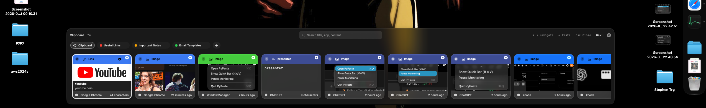

<p align="center">
  
</p>

<h1 align="center">PyPaste</h1>

<p align="center">
  Trình quản lý clipboard native, nhanh và ưu tiên quyền riêng tư dành cho macOS.<br>
  A fast, private, native clipboard manager for macOS.
</p>

## Tiếng Việt

### Giới thiệu

PyPaste là ứng dụng quản lý clipboard native dành cho macOS 14 trở lên. Ứng dụng lưu lịch sử
clipboard trên máy, giúp bạn tìm kiếm, xem trước, sắp xếp và dán lại nội dung nhanh bằng bàn
phím hoặc chuột.

### Xem trước ứng dụng



Quick Bar nằm ở cạnh dưới màn hình, giúp bạn truy cập lịch sử clipboard, tìm kiếm, danh mục,
ứng dụng nguồn và nội dung preview mà không làm gián đoạn công việc đang thực hiện.

### Tính năng nổi bật

- Mở Quick Bar ở cạnh dưới màn hình bằng `⌘⇧V`.
- Dùng `←` / `→` để chọn, `Return` để dán và `Esc` để đóng.
- Lưu text, link, mã màu HEX, hình ảnh, PDF, file và clipboard nhiều item.
- Tìm kiếm gần đúng theo tiêu đề, nội dung, ứng dụng nguồn, bundle identifier và loại dữ liệu.
- Lưu các nội dung quan trọng lâu dài trong collections.
- Preview ảnh chụp màn hình, hình ảnh, màu sắc và liên kết HTTP(S).
- Kéo thả để thay đổi thứ tự card hoặc đưa nội dung sang ứng dụng macOS khác.
- Lưu lịch sử clipboard cục bộ trên máy Mac.
- Hỗ trợ giao diện tiếng Việt và tiếng Anh.

### Cài đặt và sử dụng

Đọc [hướng dẫn sử dụng song ngữ](./docs/USER_GUIDE.md) để xem cách cài đặt, cấp quyền
Accessibility, sử dụng tính năng, phím tắt và khắc phục sự cố.

Tải bản thử nghiệm mới nhất tại
[GitHub Releases](https://github.com/pypy-studio-universe/pypaste/releases).

### Cảm ơn và ủng hộ

Cảm ơn bạn đã sử dụng, đóng góp và đồng hành cùng PyPaste. Sự ủng hộ của bạn là động lực để
ứng dụng tiếp tục được duy trì, hoàn thiện và phát triển thêm những tính năng hữu ích.

Bạn có thể [ủng hộ PyPaste qua PayPal](https://www.paypal.com/ncp/payment/JXUF3RG3FSY6U) —
mỗi đóng góp giúp tôi dành thêm thời gian để cải thiện và phát triển ứng dụng.

Hoặc quét mã QR MoMo:


### Phát triển

Mở `PyPaste.xcworkspace` bằng Xcode và chọn development team của bạn cho app target cùng các
test target. Repository không lưu Personal Team ID của người phát triển.

```sh
./scripts/format.sh
./scripts/lint.sh
xcodebuild -workspace PyPaste.xcworkspace -scheme PyPaste -destination 'platform=macOS' build
```

Kế hoạch sản phẩm và kỹ thuật nằm trong [PLAN.md](./PLAN.md). Khi tiếp tục phát triển, hãy bắt
đầu tại [mục lục theo dõi tiến độ](./progress/README.md).

### Quyền riêng tư và bảo mật

Lịch sử clipboard được lưu cục bộ. Kết nối mạng chỉ được dùng để tải preview giới hạn cho liên
kết HTTP(S). Build product, credential, trạng thái Xcode cục bộ và signing identifier cá nhân
không được đưa vào source control.

### Trạng thái

Phiên bản 0.1.0 hiện là development preview và chưa phải bản phân phối production đã notarize.

---

## English

### Overview

PyPaste is a native clipboard manager for macOS 14 or later. It stores clipboard history
locally and lets you search, preview, organize, and paste content quickly with the keyboard or
mouse.

### App preview


The bottom Quick Bar keeps clipboard history, search, collections, source applications, and
rich previews within reach while you continue working in another macOS app.

### Highlights

- Open the bottom Quick Bar with `⌘⇧V`.
- Navigate with `←` / `→`, paste with `Return`, and close with `Esc`.
- Capture text, links, HEX colors, images, PDFs, files, and multi-item clipboard payloads.
- Search by title, content, source app, bundle identifier, and content type.
- Keep important clips in persistent collections.
- Preview screenshots, images, colors, and HTTP(S) links.
- Reorder cards or drag their original content into another macOS application.
- Keep clipboard history on the local Mac.
- Use the interface in English or Vietnamese.

### Installation and usage

Read the [bilingual user guide](./docs/USER_GUIDE.md) for installation, Accessibility access,
features, keyboard controls, and troubleshooting.

Download the latest development preview from
[GitHub Releases](https://github.com/pypy-studio-universe/pypaste/releases).

### Thank you and support

Thank you for using, supporting, and contributing to PyPaste. Your support helps me spend more
time maintaining the app, improving its quality, and building useful new features.

You can [support PyPaste through PayPal](https://www.paypal.com/ncp/payment/JXUF3RG3FSY6U) —
every contribution helps me dedicate more time to improving and developing the app.

Alternatively, scan the MoMo QR code:


### Development

Open `PyPaste.xcworkspace` in Xcode. Select your own development team for the PyPaste app and
test targets; the repository intentionally does not commit a Personal Team ID.

```sh
./scripts/format.sh
./scripts/lint.sh
xcodebuild -workspace PyPaste.xcworkspace -scheme PyPaste -destination 'platform=macOS' build
```

The product and engineering roadmap is in [PLAN.md](./PLAN.md). Start development sessions at
the [progress tracker index](./progress/README.md).

### Privacy and security

Clipboard history is stored locally. Network access is used only for bounded HTTP(S) rich-link
previews. Build products, credentials, local Xcode state, and personal signing identifiers are
excluded from source control.

### Status

Version 0.1.0 is a development preview. It is not yet a notarized production distribution.
